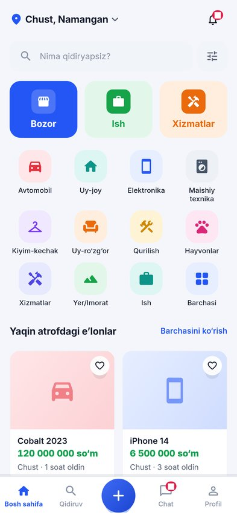
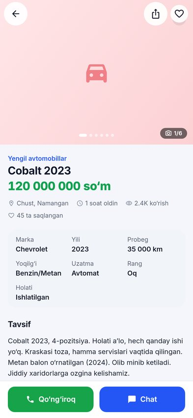
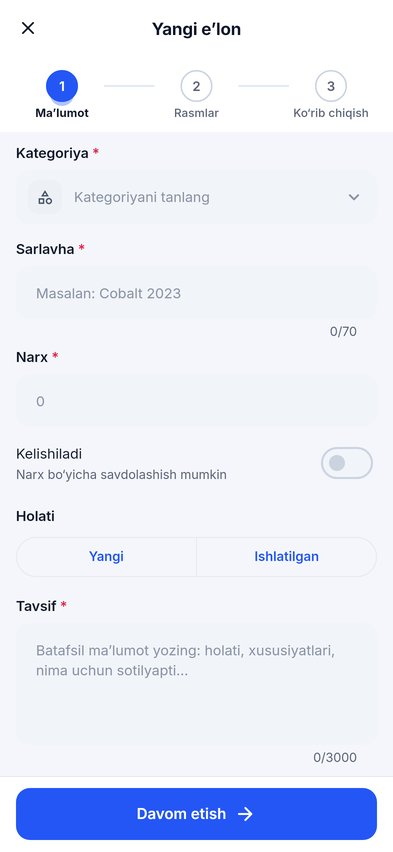
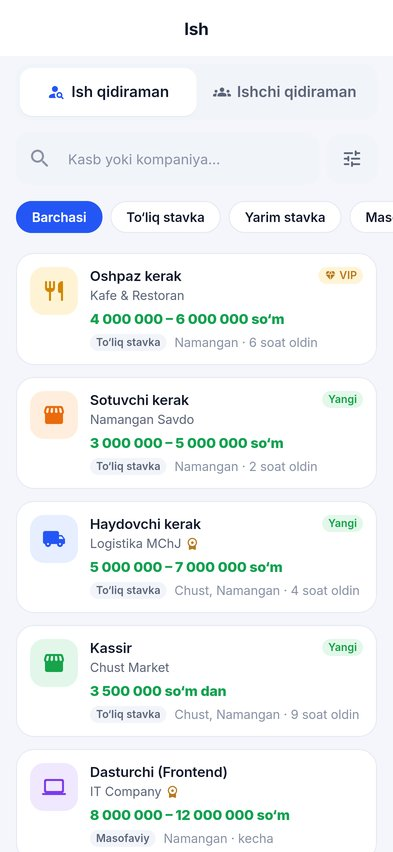
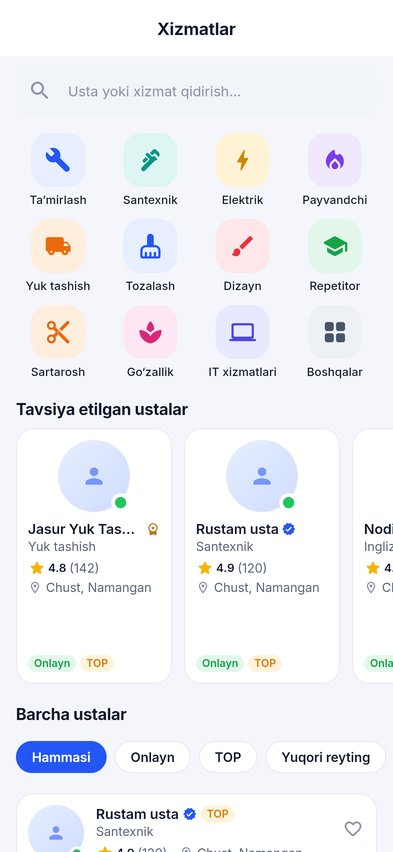
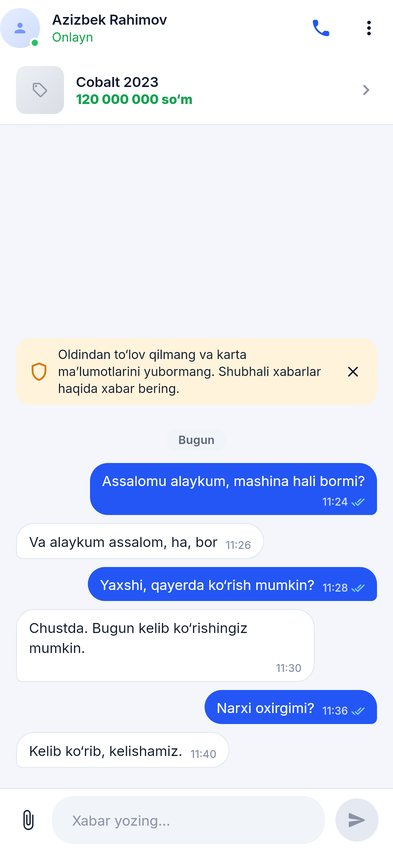

# Bozor.uz — mobile app

Local-first marketplace for Uzbekistan that combines **classifieds (E’lonlar)**, **jobs (Ish)** and **local services (Xizmatlar)** in one Flutter app for Android and iOS.

| Home | Listing | Create | Jobs | Services | Chat |
|---|---|---|---|---|---|
|  |  |  |  |  |  |

Screenshots are rendered by the test suite with network images disabled, so photos show the category placeholder. On a device, demo listings load photos from Unsplash.

## Requirements

- Flutter **3.47.x stable** (Dart 3.13)
- Android: Android SDK (compileSdk 36, minSdk 24), JDK 17
- iOS: Xcode 16+, CocoaPods, iOS 15.0+

## Run

```bash
flutter pub get
flutter run                                   # debug build on local demo data (no backend)
flutter run --dart-define=API_BASE_URL=http://10.0.2.2:3000/api/v1   # Android emulator → local backend
```

The backend lives in [`backend/`](backend/README.md) (NestJS, PostgreSQL/PostGIS, Redis, BullMQ, Socket.IO, S3). With `API_BASE_URL` set every feature talks to it — auth (phone OTP), listings, media upload, favorites, search, jobs/applications/CV, services/reviews, realtime chat and notifications — and server failures are shown as errors, never replaced by demo data. A **release** build without `API_BASE_URL` refuses to start unless `DEMO_MODE=true` is passed explicitly.

### Build-time configuration (`--dart-define`)

| Key | Default | Purpose |
|---|---|---|
| `API_BASE_URL` | *(empty → demo data in debug)* | Backend base URL including `/api/v1` |
| `DEMO_MODE` | `false` | Allow demo data in a release build (store demos only) |
| `FIREBASE_API_KEY`, `FIREBASE_APP_ID`, `FIREBASE_SENDER_ID`, `FIREBASE_PROJECT_ID`, `FIREBASE_IOS_BUNDLE_ID` | *(empty → push disabled)* | Firebase Cloud Messaging; without them the app uses in-app notifications only |
| `WEB_BASE_URL` | `https://bozor.uz` | Share links / App Links / Universal Links host |
| `APP_SCHEME` | `bozor` | Custom URL scheme (`bozor://app/listing/42`) |
| `SUPPORT_TELEGRAM_URL` | `https://t.me/bozoruz_support` | Help → support button. **Replace with the real account.** |
| `SENTRY_DSN`, `SENTRY_ENVIRONMENT`, `APP_RELEASE` | *(empty → crash reporting off)* | Sentry crash reports (no user data, no request bodies). |
| `DEMO_LATENCY_MS` | `450` | Simulated latency for demo repositories |
| `FF_AI_LISTING_ASSIST` | `false` | Photo → title/description suggestions in the create flow |

Monetization switches, prices and plan limits are **not** build settings: the app reads them from `GET /config` and the catalog endpoints, and admins change them at runtime (see [docs/monetization.md](docs/monetization.md)).

### Android release signing

Create `android/key.properties` (git-ignored):

```properties
storeFile=/absolute/path/upload-keystore.jks
storePassword=...
keyAlias=upload
keyPassword=...
```

Without it, release builds fall back to debug signing (local testing only).

## Quality checks

```bash
dart format -l 120 lib test tool
flutter analyze
flutter test                                                  # unit + widget + responsive tests
LIVE_API_URL=http://localhost:3000/api/v1 flutter test test/integration   # app data layer against a running dev backend (OTP_DEV_ECHO=true)
flutter test tool/screenshots/screens_test.dart --update-goldens   # renders all screens × 6 devices to tool/screenshots/out/
```

## Documentation

- [Architecture](docs/ARCHITECTURE.md) — layers, state, design system, performance, accessibility
- [Backend](backend/README.md) — setup, operations, required production credentials
- [API contract](docs/backend-contract.md) — endpoints, errors, realtime events, push payloads
- [Deep linking](docs/deep-linking.md) — App Links / Universal Links / Telegram share loop
- UI reference: `docs/reference/marketplace-ui.png`

Fonts: [Inter](https://rsms.me/inter/) (SIL OFL 1.1, `assets/fonts/OFL.txt`), subset to Latin, Latin Extended, Cyrillic and Uzbek apostrophes (ʻ ‘).
